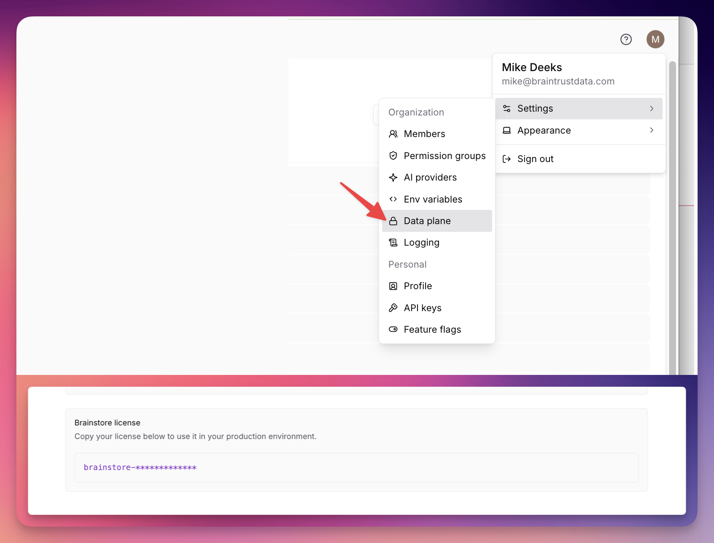
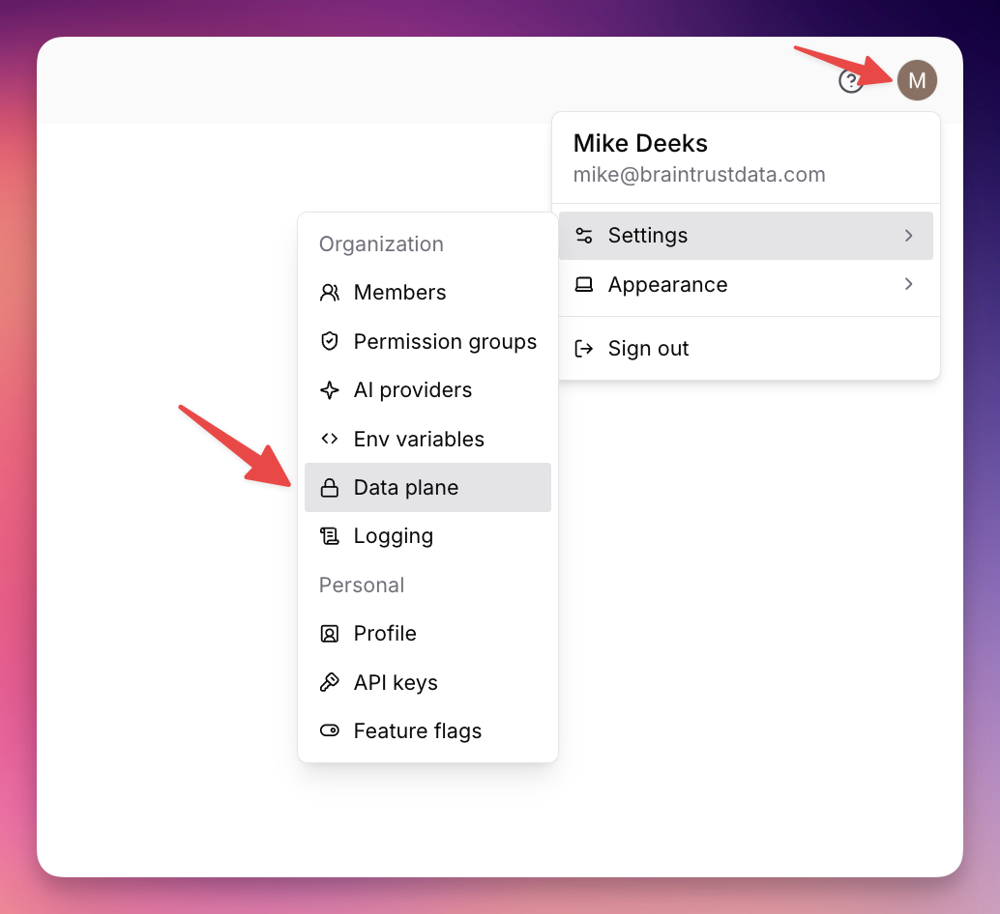
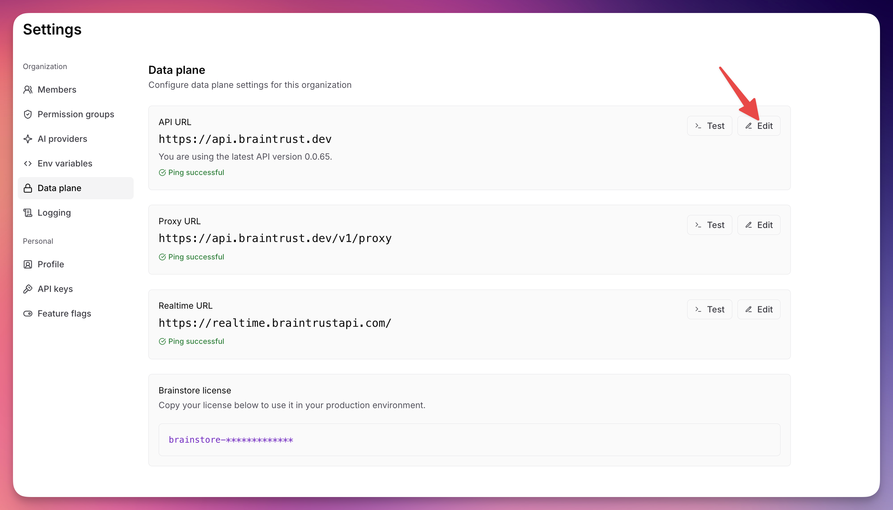
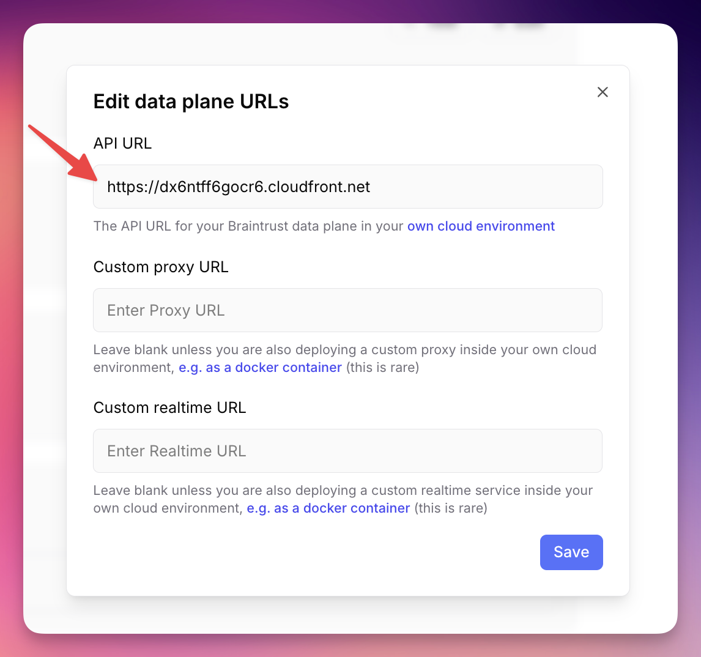
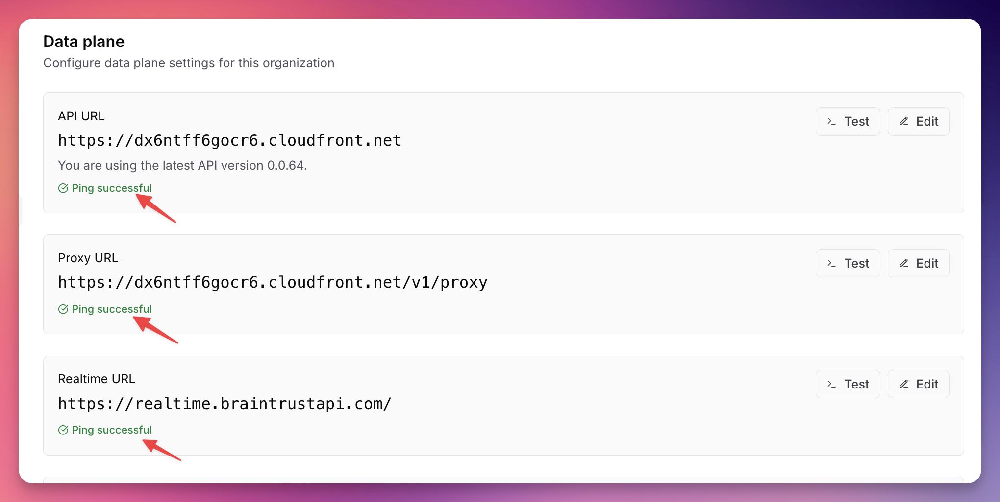

This is an example of a **sandbox** Braintrust data plane deployment for testing infrastructure provisioning, module changes, and deployment workflows. It uses minimal instance sizes and simplified infrastructure to reduce cost and setup time.

> [!WARNING]
> This configuration is **not suitable for workload testing or performance evaluation**. The downsized instances (single reader/writer, smallest instance types) will not reflect production performance. For a deployment you can run workloads against, use the [production example](../braintrust-data-plane/) with appropriately sized instances.

## What's different from production?

| Setting | Sandbox | Production |
|---|---|---|
| Postgres | db.r8g.large | db.r8g.2xlarge |
| Postgres storage | 100 GB (max 500 GB) | 1000 GB (max 10000 GB) |
| Brainstore reader | 1x c8gd.xlarge | 2x c8gd.4xlarge |
| Brainstore writer | 1x c8gd.xlarge | 1x c8gd.8xlarge |
| Redis | cache.t4g.small | cache.t4g.medium |
| Quarantine VPC | Disabled | Enabled |
| RDS deletion protection | Disabled | Enabled |

## Prerequisites

* AWS CLI configured with access to your target account
* Terraform >= 1.10
* Brainstore license key (from Braintrust UI > Settings > Data Plane)

## Configure Terraform

* `provider.tf` should be modified to use your AWS account and region.
* `terraform.tf` should be modified to use the remote backend that your company uses. Typically this is an S3 bucket and DynamoDB table.
* `main.tf` should be modified to meet your needs:
  * **`deployment_name`** — must be unique per deployment in the same AWS account (max 18 chars). Use `bt-yourname` or similar.
  * **`braintrust_org_name`** — your organization name from the Braintrust UI.
* Brainstore requires a license key which you can find in the Braintrust UI under Settings > Data Plane
  
* It isn't recommended that you commit this license key to your git repo. You can safely pass this key into terraform multiple ways:
  * Set `TF_VAR_brainstore_license_key=your-key` in your terraform environment
  * Pass it into terraform as a flag `terraform apply -var 'brainstore_license_key=your-key'`
  * Add it to an uncommitted `terraform.tfvars` or `.auto.tfvars` file.

## Initialize your AWS account

If you're using a brand new AWS account for your Braintrust data plane you will need to run `./scripts/create-service-linked-roles.sh` once to ensure IAM service-linked roles are created.

## Deploy

```bash
terraform init
terraform plan
terraform apply
```

> [!NOTE]
> The first `terraform apply` may fail with transient errors — ASG health check timeouts (instances still booting) or Lambda rate limits. Re-running `terraform apply` resolves these.

## Pointing your Organization to your data plane

After applying, get the API URL:
```
terraform output
# api_url = "https://xxxxxxxxx.cloudfront.net"
```

To configure your Organization to use your new data plane, click your user icon on the top right > Settings > Data Plane.

> [!WARNING]
> If you are testing, it is HIGHLY recommended that [you create a new Braintrust Organization](https://www.braintrust.dev/app/setup) for testing your new data plane. If you change your live Organization's API URL, you might break users who are currently using it.



Click Edit



Paste the API URL into the text field, and click Save. Leave the Proxy and Realtime URL blank.



Verify in the UI that the ping to each endpoint is successful.


## Instance type requirements

Brainstore nodes require **local NVMe/ephemeral storage** for caching. The instance user_data script will fail if no NVMe device is found, and the module validates this at plan time.

Compatible instance families include: `c8gd`, `c5d`, `m5d`, `i3`, `i4i`.

Generic families without local storage (`t3`, `m5`, `c5`) will **not** work.

## Datadog observability (optional, Braintrust staff only)

> [!NOTE]
> The `internal_observability_*` variables are for internal Braintrust engineering use. Do not set these unless instructed by Braintrust support.

To enable Datadog monitoring, uncomment the `internal_observability_*` lines in `main.tf` and provide the Datadog API key:

```bash
export TF_VAR_internal_observability_api_key=your-dd-api-key
```

This installs the Datadog agent on Brainstore EC2 instances and adds Datadog Lambda layers to all Lambda functions. Filter in Datadog by the `env` tag (set via `internal_observability_env_name`) or by `braintrustdeploymentname:<deployment_name>` (automatically added to Lambda metrics).

## Tearing down

Since this sandbox has `DANGER_disable_database_deletion_protection = true`, you can destroy after emptying S3 buckets.

The Braintrust platform writes data to S3 buckets after deployment. S3 buckets must be empty before they can be deleted, so `terraform destroy` will fail if any objects exist.

Use the included cleanup script (requires [uv](https://docs.astral.sh/uv/)):

```bash
# Dry run — lists buckets and object counts
/scripts/empty-s3-buckets.py <deployment_name>

# Empty them
/scripts/empty-s3-buckets.py <deployment_name> --delete

# Then destroy
terraform destroy
```

### If quarantine VPC is enabled

If you set `enable_quarantine_vpc = true`, the quarantine warmup Lambda creates ~30 functions outside Terraform state. These hold ENIs in the quarantine VPC subnets that block `terraform destroy`. You must delete them before destroying.

Use the included cleanup script (requires [uv](https://docs.astral.sh/uv/)):

```bash
# Dry run — lists quarantine Lambdas without deleting
/scripts/delete-quarantine-lambdas.py <deployment_name>-quarantine

# Delete them
/scripts/delete-quarantine-lambdas.py <deployment_name>-quarantine --delete

# Wait ~5 minutes for ENIs to release, then destroy
terraform destroy
```

The `<deployment_name>-quarantine` argument is the Name tag of the quarantine VPC (e.g., `bt-yourname-quarantine`).
