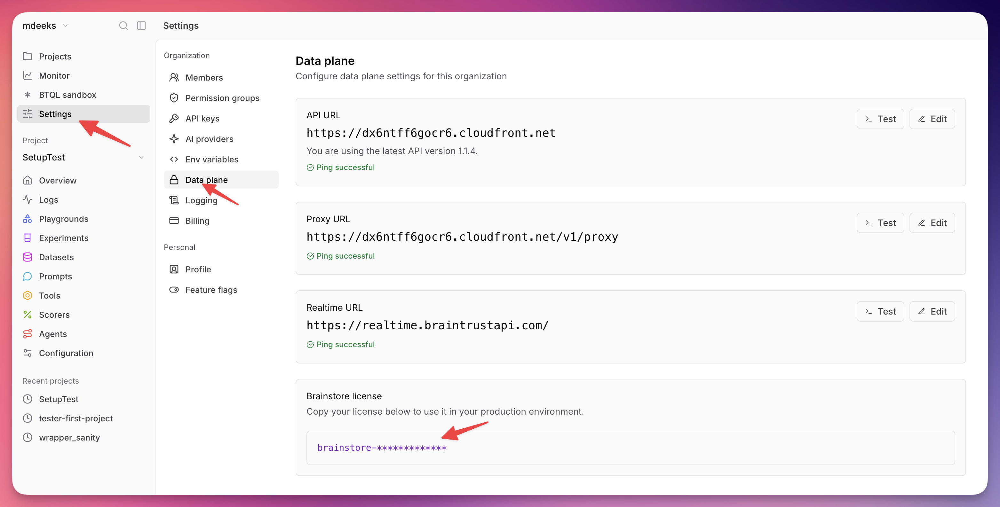
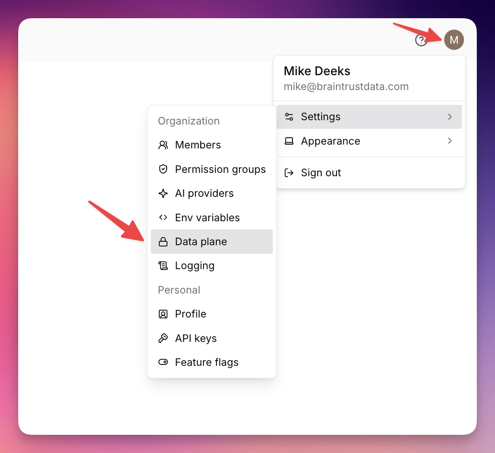
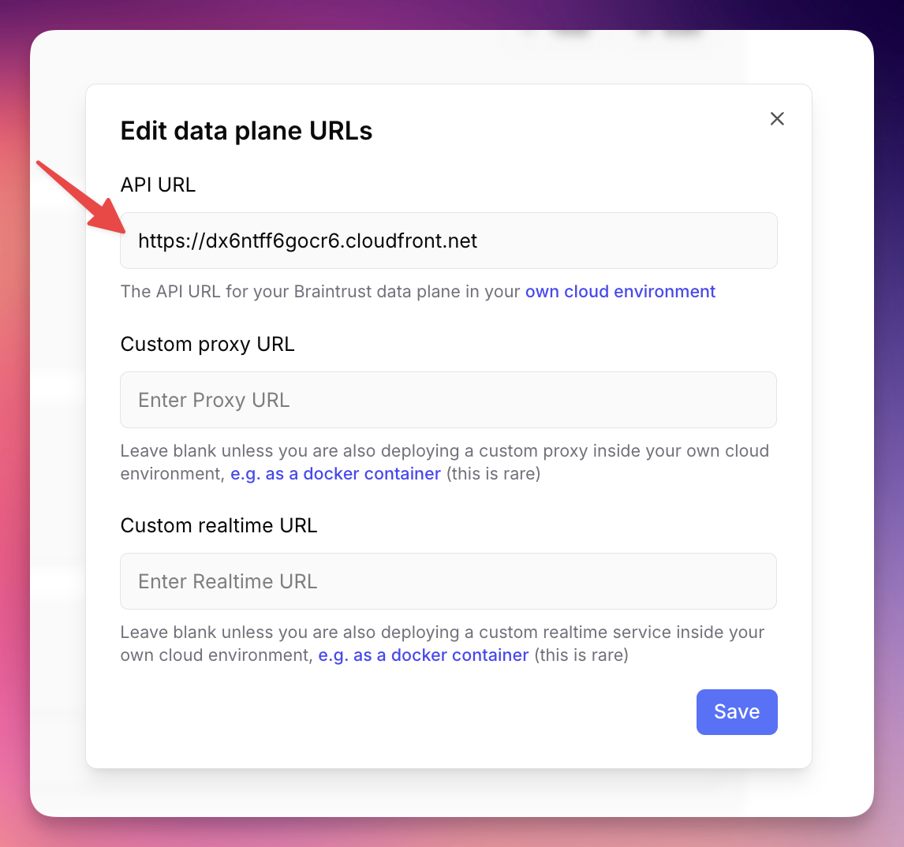
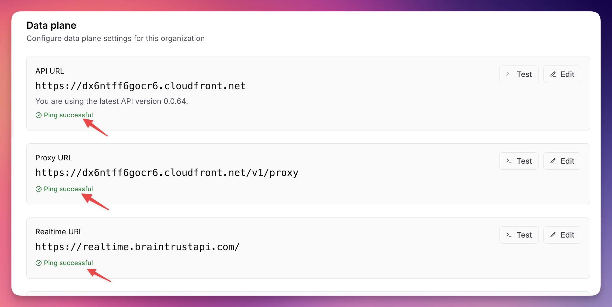

This is an example of a standard Braintrust data plane deployment. Copy this directory to a new directory in your own repository and modify the files to match your environment.

## Configure Terraform
* `provider.tf` should be modified to use your AWS account and region.
* `terraform.tf` should be modified to use the remote backend that your company uses. Typically this is an S3 bucket and DynamoDB table.
* `main.tf` should be modified to meet your needs for the Braintrust deployment. The defaults are sensible only for a small development deployment.
* Brainstore requires a license key which you can find in the Braintrust UI under Settings > Data Plane

* It isn't recommended that you commit this license key to your git repo. You can safely pass this key into terraform multiple ways:
  * Set `TF_VAR_brainstore_license_key=your-key` in your terraform environment
  * Pass it into terraform as a flag `terraform apply -var 'brainstore_license_key=your-key'`
  * Add it to an uncommitted `terraform.tfvars` or `.auto.tfvars` file.

## Initialize your AWS account
If you're using a brand new AWS account for your Braintrust data plane you will need to run ./scripts/create-service-linked-roles.sh once to ensure IAM service-linked roles are created.

## Pointing your Organization to your data plane

After applying this configuration you will have a Braintrust data plane deployed in your AWS account. You can then run `terraform output` to get the API URL you need to enter into the Braintrust UI for your Organization.
```
❯ terraform output
api_url = "https://dx6ntff6gocr6.cloudfront.net"
```

To configure your Organization to use your new data plane, click your user icon on the top right > Settings > Data Plane.

> [!WARNING]
> If you are testing, it is HIGHLY recommended that [you create a new Braintrust Organization](https://www.braintrust.dev/app/setup) for testing your new data plane. If you change your live Organization's API URL, you might break users who are currently using it.



Click Edit


Paste the API URL into the text field, and click Save. Leave the Proxy and Realtime URL blank.



Verify in the UI that the ping to each endpoint is successful.

