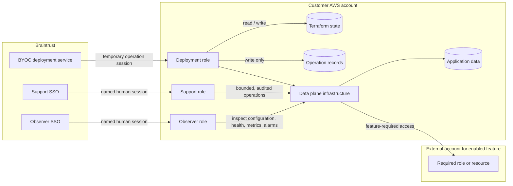

# AWS Managed BYOC v2 access and guardrail model

Status: design preview for customer security review

This package describes Braintrust's intended standard AWS access model and
customer controls for managed BYOC. We welcome security feedback from early
access customers and may incorporate improvements that benefit the standard
model. The core roles and guardrails are consistent across deployments;
account-specific identifiers and enabled features vary. This design preview
is not a deployment template. The production bootstrap will implement the
validated model.

The AWS account must be dedicated to infrastructure managed by Braintrust. A
single Braintrust data plane may serve multiple customer teams and use cases,
and the account may host multiple Braintrust data plane deployments. Customer
applications and infrastructure unrelated to Braintrust BYOC must reside in
separate AWS accounts.

## BYOC roles

| Role | Principal | Purpose | Standing data access |
| --- | --- | --- | --- |
| `BraintrustDeploymentRole` | Braintrust deployment service | Versioned Terraform deployment operations | State, artifacts, license/module secrets, and workload configuration needed by Terraform |
| `BraintrustSupportRole` | Named Braintrust support personnel | Bounded incident response and operational changes | No standing direct access |
| `BraintrustObserverRole` | Named Braintrust personnel | Broad infrastructure diagnostics | None |

There is no Braintrust break-glass administrator role. The customer can revoke
new Braintrust sessions by removing or changing the role trust policies. For
an active incident, the customer must also revoke existing role sessions.

## Effective access

| Capability | Deployment | Support | Observer |
| --- | --- | --- | --- |
| Directly read application objects or database contents | No | No | No |
| Read Terraform state | Exact state prefix | No | No |
| Write operation records | Exact log prefix | No | No |
| Read secret values | Exact license secret and prefixed secrets managed by Terraform | No | No |
| Read workload configuration containing credentials | Configuration managed by the module | No | No |
| Decrypt application data | No | No | No |
| Read infrastructure metrics, alarms, and configuration | Yes | Yes | Yes |
| Read application log bodies | No | No | No |
| Update ECS services and ECS autoscaling | Yes | Scoped | No |
| Scale Brainstore instances, replace unhealthy instances, or cancel a rollout | Yes | Scoped | No |
| Tune Lambda reserved and provisioned concurrency | Yes | Scoped | No |
| Pause or resume the module's scheduled jobs | Yes | Scoped | No |
| Reboot databases/caches or tune the database parameter group | Yes | Scoped | No |
| Create or replace infrastructure definitions | Yes | No | No |
| Create data plane IAM roles | Yes, with the required boundary | No | No |
| Pass data plane roles to AWS services | Specified roles and services only | No | No |
| Change the three BYOC roles or guardrails | No | No | No |
| Delete retained customer data | No | No | No |

Deployment automation reads only one secret provided by the customer: the
license key. The current Terraform module also creates database, Redis, and
internal runtime secrets, and reads some values during planning and refresh. The
deployment role therefore receives `GetSecretValue` for the exact license secret
and secrets whose names begin with the managed resource prefix.
Terraform state can contain generated credentials and must be treated as
sensitive. Human roles have no state or secret access. Deployment automation
can invoke only the module's database migration and quarantine warmup hooks;
general workload invocation is denied. It also manages encrypted Lambda
environment variables, which can contain credentials managed by the module.
This is a documented deployment exception, not human diagnostic access.

CloudWatch metrics, alarms, dashboards, resource state, and log group metadata
are diagnostic metadata. Application log events and Logs Insights results are
treated as possible customer data and are excluded from both human roles.
Keep secrets and customer payloads out of names, tags, descriptions, stack
outputs, and task overrides visible through diagnostic APIs.

## Policy set

The policy files in this preview are standalone JSON under `policies/`. The deployment
permissions are split into two identity policies because AWS limits each managed
policy document to 6,144 characters. The split follows a useful review boundary
rather than creating one policy per AWS service.

| Policy | Attached to | Purpose | Change rate |
| --- | --- | --- | --- |
| `deployment-infrastructure-policy.json` | Deployment role | AWS service, scoped IAM, and tagged KMS key administration | Evolves with the data plane module |
| `deployment-data-policy.json` | Deployment role | State, artifacts, operational records, secrets, S3, and KMS | Evolves with storage and secret handling |
| `deployment-permissions-boundary.json` | Deployment role | Stable maximum permissions for automation | Rare; versioned bootstrap update |
| `runtime-permissions-boundary.json` | Every runtime role created by Terraform | Baseline maximum for workload identities | Rare; versioned bootstrap update |
| `observer-policy.json` | Observer and Support roles | Broad diagnostic metadata with explicit denials for content and interactive access | Internally reviewed additions |
| `support-policy.json` | Support role | Operations limited to matching resources | Internally reviewed additions |

The trust policies under `trust-policies/` restrict each customer role to one
exact Braintrust principal. Machine sessions additionally require a unique
External ID and an operation source identity. Human sessions must inherit a
source identity established by Braintrust's identity provider or access broker.
The attribution flow, including console access, must be validated before use;
see [`trust-policies/README.md`](trust-policies/README.md).

## IAM creation and `PassRole`

The data plane is an evolving product and must be able to add, update, and
remove runtime IAM roles and policies. The deployment role can manage only IAM
resources whose names begin with the configured managed resource prefix. Every
created role must carry the runtime permissions boundary owned by the customer.
`iam:PassRole` is limited to matching roles and a specified list of AWS
services. The deployment role cannot assume runtime roles itself.

## Human operations model

Observer and Support can inspect infrastructure configuration and health,
including metrics, alarms, deployments, scaling settings, and schedules.
Neither role can read Terraform state, secrets, application data, or application
log bodies, or open a shell.

Support can also make incident changes to ECS services and tasks, Brainstore
scaling within existing limits and instance health, Lambda concurrency, and
scheduled jobs. It can reboot databases or caches and tune database parameters.
It cannot define workloads, change IAM, or pass roles. Instance types,
database capacity, and network changes use the deployment workflow.

These permissions can affect availability and cost. ECS service updates can
change more than task count, and ECS Application Auto Scaling permissions apply
across the account in the configured Region. Record and monitor support changes,
restore temporary overrides, and reconcile lasting changes through the
deployment workflow.

## Customer guardrails

The two SCPs under `guardrails/` are applied by the customer's AWS
Organizations administrators. They do not grant access. They reinforce the
runtime boundary requirement, IAM prefix, specified `PassRole` services,
bootstrap role protection, data access restrictions, retained data protections,
and audit control protection independently of Braintrust identity policies.

The access guarantees described here require the complete policy set,
including both SCPs. Customers retain control of the license secret, bootstrap
policies and trust, state and operation log buckets, and any customer-managed
encryption keys.

Recommended monitoring and recovery controls:

1. Send organization CloudTrail events to a customer log archive account that
   Braintrust roles cannot modify.
2. Enable management events and the targeted data events listed in the alerting
   guide, including S3, Lambda, DynamoDB, and SQS where used.
3. Implement the minimum event alerts in
   [`guardrails/cloudtrail-alerting.md`](guardrails/cloudtrail-alerting.md),
   including alerts for role assumption, human mutations, identity control
   changes, attempts to access sensitive data, retained data deletion, public
   exposure, interactive access, and audit tampering.
4. Retain a recovery path controlled by the customer outside the Braintrust
   trust chain.

The KMS controls separate key administration from data use: deployment grants
are limited to grants created by AWS services, and explicit denials restrict
decryption to specified keys and the documented Secrets Manager, S3, and Lambda
configuration paths. Customer bootstrap keys and storage settings are protected
from deployment changes.

## Access outside the BYOC account

A dedicated account does not mean the data plane never uses another AWS account.
The intended boundary depends on who is making the request:

| Access path | Default | External access |
| --- | --- | --- |
| Deployment, Support, and Observer roles | Operate in the BYOC account | Deployment reads the named Braintrust-hosted software bucket; the customer SCP blocks access to other externally owned S3 buckets |
| Data plane workloads | Use resources in the BYOC account | An enabled feature may require an exact external role or resource |

For example, the Bedrock integration can require the Gateway to assume a scoped
role in another account to call a configured model. S3 export can require the
data plane to assume a scoped role to write requested exports to a
customer-designated S3 bucket, including one in another account.

Runtime roles cannot assume another role under the baseline boundary. A feature
that needs this access requires an explicit destination role ARN in the workload
policy, a feature-specific allowance in the customer-controlled boundary,
and a destination trust policy limited to the intended workload role. Direct
access to an external bucket, key, or other resource likewise requires
feature-specific resource and owner-account scope. These boundary changes do
not grant access on their own.
The sample policies do not yet impose an account-owner limit on every runtime
service API; direct external access needs controls specific to that integration.

For each feature with external access, Braintrust will document the source
workload, destination, purpose, required actions, customer configuration, and
audit events. Customers configure the documented access to use the feature;
otherwise that feature remains unavailable. Exact destinations vary by
installation, but the permission pattern is a published feature requirement,
not a case-by-case approval process. Normal updates within the existing
boundary need no new cross-account configuration. AWS does not supply
resource-owner context for every API, so the S3 owner-account SCP is one
concrete guardrail, not a claim that a single condition protects every AWS
service. Once a workload assumes a role in another account, that role's
permissions and the destination account's controls govern its subsequent calls.

## Stable guardrails and evolving permissions

Deployment allow policies will change as the Terraform module gains or removes
features. Those changes will be versioned with the required customer
configuration.
The trust policies, permissions boundaries, SCP, audit ownership, and data
access invariants are the more stable security contract.

The deployment role cannot edit its own role, trust policy, attached policies,
or permissions boundary. Increasing its maximum access therefore requires a
bootstrap update controlled by the customer. It can change runtime policies
created by the module, but each runtime role remains capped by the boundary
owned by the customer.

## Data disposition

`retain-data` is the customer default. Deprovisioning removes serving
infrastructure while retaining the Brainstore bucket and its controls, the KMS
key and alias created by the module, and an encrypted final RDS snapshot for
customer disposition. The Terraform state bucket and operation log bucket also
remain under customer control. Permanent workload data erasure is not part of
this customer package.

The deployment boundary and the SCP that protects retained data together deny
deletion of the exact Brainstore bucket and its objects, disablement or scheduled
deletion of the retained KMS key, deletion of matching final RDS snapshots, and
deletion of operation records. The deprovisioning workflow must detach those
resources from Terraform state before destroying serving infrastructure.

Terraform continues to manage the Brainstore lifecycle configuration during
normal operation. AWS IAM cannot distinguish an approved lifecycle change from
one that introduces an unsafe expiration rule. Customers should alert on every
`PutBucketLifecycleConfiguration` call and rely on bucket versioning, recovery
testing, reviewed plans, and their chosen retention controls. This limitation is
explicit rather than presenting `retain-data` as an absolute IAM guarantee.

## Important limitation

Deployment automation can change data plane workloads. IAM removes standing
direct data reads and common paths for privilege escalation, but cannot prove
that privileged deployment code could never construct an indirect path through
a workload with data access. Support's permitted workload changes also require
operational review and attribution. Reviewed Terraform plans, immutable module
versions, temporary operation credentials, audit evidence owned by the customer,
monitoring, and customer revocation are therefore part of the security boundary.

## Reviewing the files

Replace the documented placeholders with values specific to each account before
using any policy. `policies/README.md` lists them and explains the attachment
model. `guardrails/README.md` explains the SCP and rollout precautions. Run
`./validate.sh` to check JSON syntax and AWS policy size limits. The script can
also use IAM Access Analyzer when AWS credentials are available.

## Preview change history

This table records customer-visible changes to the review package, not changes
deployed to any AWS account. New entries appear first.

| Date | Change | What to review |
| --- | --- | --- |
| 2026-09-23 | Simplified the access diagram and human operations summary; clarified that external access is a documented feature requirement, not a case-by-case approval. No permissions changed. | Role access and operating boundaries are unchanged. |
| 2026-09-23 | Added the external access model, an S3 owner-account guardrail for Braintrust roles, exact artifact bucket scope, default-deny runtime role assumption, and cross-account audit guidance. | Review the boundary between routine BYOC operations and explicitly enabled runtime integrations. |
| 2026-09-17 | Published the initial AWS BYOC v2 role, policy, and customer guardrail preview. | Baseline for subsequent feedback. |
