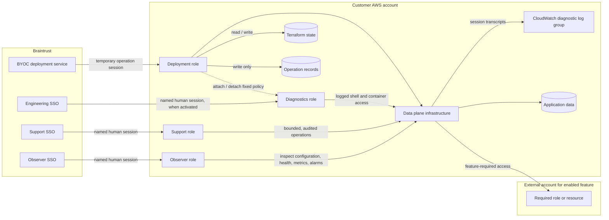
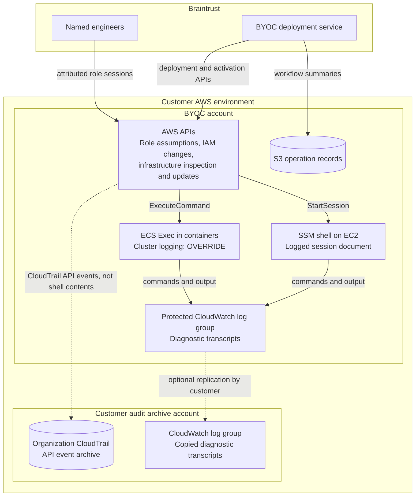

# AWS Managed BYOC v2 access and guardrail model

Status: design preview for customer security review

This package describes Braintrust's intended standard AWS access model and
customer controls for managed BYOC. We welcome security feedback from early
access customers and may incorporate improvements that benefit the standard
model. The core roles and guardrails are consistent across deployments;
identifiers for each account and enabled features vary. This design preview
is not a deployment template. The production bootstrap will implement the
validated model.

BYOC separates routine operations from troubleshooting that can access customer
data. Deployment remains privileged and can access state and secrets managed by
the module. Routine human roles have no direct access to application data;
activated Diagnostics can access and modify data through workloads. Guardrails
and audit records owned by the customer reduce risk and provide accountability,
but do not eliminate the trust required to let Braintrust manage the data plane.

The AWS account must be dedicated to infrastructure managed by Braintrust. A
single Braintrust data plane may serve multiple customer teams and use cases,
and the account may host multiple Braintrust data plane deployments. Customer
applications and infrastructure unrelated to Braintrust BYOC must reside in
separate AWS accounts.

Each bootstrap reserves a unique, non-overlapping name prefix in that account.
Every data plane it manages uses a `deployment_name` beginning with that
prefix. This lets the same safeguards cover additional data planes without
binding generated bucket names or key IDs after creation. These examples cover
one configured AWS Region; additional Regions require corresponding policy scope.

## BYOC roles

| Role | Principal | Purpose | Standing data access |
| --- | --- | --- | --- |
| `BraintrustDeploymentRole` | Braintrust deployment service | Versioned Terraform deployment operations | State, artifacts, license/module secrets, and workload configuration needed by Terraform |
| `BraintrustSupportRole` | Named Braintrust support personnel | Bounded incident response and operational changes | No standing direct access |
| `BraintrustObserverRole` | Named Braintrust personnel | Inspect infrastructure configuration, health, and metrics | None |
| `BraintrustDiagnosticsRole` | Named Braintrust engineers | Temporary shell, container, and application log access | No diagnostic policy attached by default; data access when activated |

Diagnostics is a scoped troubleshooting role, not an unrestricted administrator.
The customer can block new Braintrust sessions by changing role trust. Ending
existing access also requires [credential revocation and session cleanup](diagnostics.md#customer-revocation).

```mermaid
flowchart LR
    subgraph Braintrust
        M[BYOC deployment service]
        H[Support SSO]
        O[Observer SSO]
        E[Engineering SSO]
    end

    subgraph Customer AWS account
        D[Deployment role]
        S[Support role]
        R[Observer role]
        G[Diagnostics role]
        C[CloudWatch diagnostic log group]
        T[(Terraform state)]
        L[(Operation records)]
        I[Data plane infrastructure]
        A[(Application data)]
    end

    subgraph External account for enabled feature
        X[Required role or resource]
    end

    M -->|temporary operation session| D
    H -->|named human session| S
    O -->|named human session| R
    D -->|read / write| T
    D -->|write only| L
    D --> I
    D -.->|attach / detach fixed policy| G
    E -->|named human session, when activated| G
    G -->|logged shell and container access| I
    I -->|session transcripts| C
    S -->|bounded, audited operations| I
    R -->|inspect configuration, health, metrics, alarms| I
    I --> A
    I -->|feature-required access| X
```

## Effective access

| Capability | Deployment | Support | Observer | Diagnostics, when activated |
| --- | --- | --- | --- | --- |
| Directly read application objects or database contents | No | No | No | Through workload access; no direct AWS grant to read data |
| Read Terraform state | Exact state prefix | No | No | No |
| Write operation records | Exact log prefix | No | No | No |
| Read secret values | Exact license secret and prefixed secrets managed by Terraform | No | No | Through workload access; no direct Secrets Manager grant |
| Read workload configuration containing credentials | Configuration managed by the module | No | No | Through workload access |
| Decrypt application data | No direct grant | No | No | Through workload access; no direct KMS decrypt grant |
| Read infrastructure metrics, alarms, and configuration | Yes | Yes | Yes | Target discovery; use Observer for broad inspection |
| Read application log bodies | No | No | No | Matching application logs |
| Open a shell or execute inside a container | No | No | No | Managed Brainstore instances and ECS tasks |
| Update ECS services and ECS autoscaling | Yes | Scoped | No | Use Support |
| Scale Brainstore instances, replace unhealthy instances, or cancel a rollout | Yes | Scoped | No | Use Support |
| Tune Lambda reserved and provisioned concurrency | Yes | Scoped | No | Use Support |
| Pause or resume the module's scheduled jobs | Yes | Scoped | No | Use Support |
| Reboot databases/caches or tune the database parameter group | Yes | Scoped | No | Use Support |
| Create or replace infrastructure definitions | Yes | No | No | No |
| Create data plane IAM roles | Yes, with the required boundary | No | No | No |
| Pass data plane roles to AWS services | Specified roles and services only | No | No | No |
| Change BYOC roles or guardrails | Fixed Diagnostics policy attachment only | No | No | No |
| Delete retained customer data | No direct grant | No | No | No direct grant; shell can modify workload data |

Deployment automation reads only one secret provided by the customer: the
license key. The current Terraform module also creates database, Redis, and
internal runtime secrets, and reads some values during planning and refresh. The
deployment role therefore receives `GetSecretValue` for the exact license secret
and secrets whose names begin with the managed resource prefix.
Terraform state can contain generated credentials and must be treated as
sensitive. Support and Observer have no state or secret access. Diagnostics has
no direct grant to read state or secrets, but can reach runtime credentials through
a shell. Deployment automation can invoke only the module's database migration
and quarantine warmup hooks;
general workload invocation is denied. It also manages encrypted Lambda
environment variables, which can contain credentials managed by the module.
This is a documented deployment exception, not human diagnostic access.

CloudWatch metrics, alarms, dashboards, resource state, and log group metadata
are diagnostic metadata. Application log events and Logs Insights results are
treated as possible customer data and are excluded from Support and Observer.
Keep secrets and customer payloads out of names, tags, descriptions, stack
outputs, and task overrides visible through diagnostic APIs.

## Policy set

The [policy guide](policies/README.md#role-attachment-model) maps each JSON file
to its role. Deployment uses four policies: infrastructure, data, Diagnostics
activation, and future EKS permissions. Observer and Support share an inspection
policy; Support adds bounded operations. Diagnostics receives its separate policy
only during activation. Deployment and runtime roles also have permissions boundaries.
The EKS permissions do not enable Kubernetes access.

The trust policies under `trust-policies/` restrict each customer role to one
exact Braintrust principal. Machine sessions additionally require a unique
External ID and an operation source identity. Human sessions must inherit a
source identity established by Braintrust's identity provider or access broker.
The attribution flow, including console access, must be validated before use;
see [`trust-policies/README.md`](trust-policies/README.md).

The deployment role policies describe the maximum access across all data
planes under one bootstrap. Some infrastructure permissions and discovery APIs
apply across the account; the prefix is not complete isolation between data planes.
The policies do not yet narrow credentials for each deployment operation. Assess
this preview against the full role permissions, not an assumed limit for each
operation.

## IAM creation and `PassRole`

The data plane is an evolving product and must be able to add, update, and
remove runtime IAM roles and policies. The deployment role can manage only IAM
resources whose names begin with the configured managed resource prefix. Every
created role must carry the runtime permissions boundary owned by the customer.
`iam:PassRole` is limited to matching roles and a specified list of AWS
services. The deployment role cannot assume runtime roles itself. The runtime
boundary denies SSM sessions, Run Command, ECS Exec, and EC2 Instance Connect
initiated by workloads. Agent permissions needed to receive diagnostic sessions remain
available.

## Human operations model

Observer and Support can inspect infrastructure configuration and health,
including metrics, alarms, deployments, scaling settings, and schedules.
Neither role can read Terraform state, secrets, application data, or application
log bodies, open a shell, or assume another role.

The module's legacy support access options remain disabled. Human access uses
only the bootstrap roles described here.

Support can also make maintenance or incident changes to ECS services and tasks,
Brainstore scaling within existing limits and instance health, Lambda concurrency, and
scheduled jobs. It can reboot databases or caches and tune database parameters.
It cannot define workloads, change IAM, or pass roles. Instance types,
database capacity, and network changes use the deployment workflow.

These permissions can affect availability and cost. ECS service updates can
change more than task count, and ECS Application Auto Scaling permissions apply
across the account in the configured Region. Record and monitor support changes,
restore temporary overrides, and reconcile lasting changes through the
deployment workflow.

## Temporary Diagnostics access

Some investigations need host or container access. Diagnostics provides that
access separately from standing Support and Observer permissions. One activation
covers all data planes under the bootstrap and multiple engineers, each using
their own attributed session. Braintrust manages activation under the recorded
customer access setting. The default activation lasts two hours; extensions are
explicit and recorded, not automatic.

The deployment service can attach or detach only the fixed diagnostic policy.
It cannot rewrite that policy or restore trust removed by the customer. Closure
requires permission removal and cleanup of active sessions; policy detachment
alone is not proof that existing sessions have ended. These are implementation
requirements, not completed workflow guarantees.

The supported paths are logged Session Manager shells and ECS Exec. We do not
use SSH or port forwarding sessions for this access model. Diagnostic transcripts
are stored in a CloudWatch log group in the customer account with default encryption.
Diagnostics can access and modify data through workloads and their runtime
credentials, and may provide root access.

See the [Diagnostics guide](diagnostics.md) for permissions, logging prerequisites,
and customer revocation. [Kubernetes permissions](kubernetes-permissions.md)
define the future role profiles only; they do not enable Kubernetes access.

## Customer guardrails

The three SCPs under `guardrails/` illustrate safeguards owned by the customer. They
do not grant access. They reinforce the runtime boundary requirement, IAM
prefix, specified `PassRole` services, bootstrap role protection, data access
restrictions, retained data protections, and audit control protection
independently of Braintrust identity policies. The effective safeguards are
part of this model; customers can provide equivalent organization controls
instead of copying these example SCPs if the combined behavior is validated.
Customers retain control of the license secret, bootstrap policies and trust,
state and operation log buckets, and any encryption keys managed by the customer.

Recommended monitoring and recovery controls:

1. Send organization CloudTrail events to a customer log archive account that
   Braintrust roles cannot modify.
2. Enable management events and the targeted data events listed in the alerting
   guide, including S3, Lambda, DynamoDB, and SQS where used.
3. Implement the minimum event alerts in
   [`guardrails/cloudtrail-alerting.md`](guardrails/cloudtrail-alerting.md),
   including alerts for role assumption, human mutations, identity control
   changes, attempts to access sensitive data, retained data deletion, public
   exposure, interactive access, and audit tampering.
4. Retain a recovery path controlled by the customer outside the Braintrust
   trust chain.

The KMS controls separate key administration from data use: deployment grants
are limited to grants created by AWS services, and explicit denials restrict
decryption to specified keys and the documented Secrets Manager, S3, and Lambda
configuration paths. Customer bootstrap keys and storage settings are protected
from deployment changes.

## Logging and operation records

Three complementary records stay in storage controlled by the customer: CloudTrail
records AWS API activity, CloudWatch stores diagnostic session commands and
output, and operation records explain the deployment or access workflow.
Operation records include deployment outcomes and, for Diagnostics, the
authorizing actor, reason, scope, expiry, extensions, and cleanup result.
Both session paths write to the protected log group
`/braintrust-byoc/<BOOTSTRAP_NAME>/diagnostics` in the BYOC account.

```mermaid
flowchart TB
    subgraph BT[Braintrust]
        DEP[BYOC deployment service]
        ENG[Named engineers]
    end

    subgraph CUSTOMER[Customer AWS environment]
        subgraph BYOC[BYOC account]
            API["AWS APIs<br/>Role assumptions, IAM changes,<br/>infrastructure inspection and updates"]
            SSM["SSM shell on EC2<br/>Logged session document"]
            ECS["ECS Exec in containers<br/>Cluster logging: OVERRIDE"]
            CW["Protected CloudWatch log group<br/>Diagnostic transcripts"]
            OPS[("S3 operation records")]
        end
        subgraph ARCHIVE[Customer audit archive account]
            CT[("Organization CloudTrail<br/>API event archive")]
            COPY["CloudWatch log group<br/>Copied diagnostic transcripts"]
        end
    end

    DEP -->|deployment and activation APIs| API
    ENG -->|attributed role sessions| API
    API -->|StartSession| SSM
    API -->|ExecuteCommand| ECS
    API -.->|CloudTrail API events, not shell contents| CT
    SSM -->|commands and output| CW
    ECS -->|commands and output| CW
    CW -.->|optional replication by customer| COPY
    DEP -->|workflow summaries| OPS
```

The customer manages organization CloudTrail and its archive. Bootstrap and
module configuration must provide the diagnostic transcript destination and
delivery permissions; these are not created by the policy files alone.

For stronger evidence separation, customers can copy diagnostic transcripts to
their audit archive account using
[CloudWatch Logs centralization](https://docs.aws.amazon.com/AmazonCloudWatch/latest/logs/CloudWatchLogs_Centralization.html)
within their AWS Organization. The customer security team controls replication
and archive retention, with no Braintrust management access to the archive.
Local collection remains the default; the additional archive is a recommended
customer control. Replication preserves delivered evidence but cannot prevent
disruption of capture on the host.

The guardrails protect the named audit resources, shell document, and transcript
destination. Management roles cannot directly insert events into the diagnostic
transcript group. Instance and task roles write the transcripts. Ordinary application
logging remains managed through deployment. Deployment also retains ECS cluster
management, including Exec logging settings, which require activation checks and
monitoring. Operation records need
[versioning and retention controls](policies/README.md) in addition to deletion
denials. Protected destinations do not guarantee uninterrupted capture from a
privileged shell; see the [logging prerequisites and limits](diagnostics.md#logging-prerequisites).

## Access outside the BYOC account

A dedicated account does not mean the data plane never uses another AWS account.
The intended boundary depends on who is making the request:

| Access path | Default | External access |
| --- | --- | --- |
| Deployment, Support, Observer, and Diagnostics roles | Operate in the BYOC account | Deployment reads the named software bucket hosted by Braintrust; the customer SCP blocks access to other externally owned S3 buckets |
| Data plane workloads | Use resources in the BYOC account | An enabled feature may require an exact external role or resource |

For example, the Bedrock integration can require the Gateway to assume a scoped
role in another account to call a configured model. S3 export can require the
data plane to assume a scoped role to write requested exports to a
S3 bucket designated by the customer, including one in another account.

The baseline permits the API handler's internal quarantine and AI Proxy invocation
roles. Other role assumptions are denied. An external feature
requires an explicit destination role ARN in the workload
policy, an allowance for that feature in the boundary controlled by the customer,
and a destination trust policy limited to the intended workload role. Direct
access to an external bucket, key, or other resource likewise requires
scope for that feature's resources and their owner accounts. These boundary changes do
not grant access on their own.
The sample policies do not yet impose a limit on resource ownership for every runtime
service API; direct external access needs controls specific to that integration.

For each feature with external access, Braintrust will document the source
workload, destination, purpose, required actions, customer configuration, and
audit events. Customers configure the documented access to use the feature;
otherwise that feature remains unavailable. Exact destinations vary by
installation, but the permission pattern is a published feature requirement,
not an individual approval process. Normal updates within the existing
boundary need no new configuration for access to other accounts. AWS does not supply
resource ownership information for every API, so the S3 account ownership SCP is one
concrete guardrail, not a claim that a single condition protects every AWS
service. Once a workload assumes a role in another account, that role's
permissions and the destination account's controls govern its subsequent calls.

## Stable guardrails and evolving permissions

Deployment allow policies will change as the Terraform module gains or removes
features. Those changes will be versioned with the required customer
configuration.
Trust restrictions, permissions boundaries, SCPs, audit ownership, and data
access restrictions form the baseline safeguards.

The deployment role cannot edit its own role, trust policy, attached policies,
or permissions boundary. Increasing its maximum access therefore requires a
bootstrap update controlled by the customer. It can change runtime policies
created by the module, but each runtime role remains capped by the boundary
owned by the customer. Its only bootstrap IAM mutation is attaching or detaching
the fixed Diagnostics policy on the designated role.

## Data disposition

`retain-data` is the customer default. Deprovisioning removes serving
infrastructure while retaining the Brainstore bucket and its controls, the KMS
key and alias created by the module, and an encrypted final RDS snapshot for
customer recovery or deletion. The Terraform state bucket and operation log
bucket also remain under customer control. Permanent workload data erasure is
not part of this customer package.

The deployment boundary and guardrail for retained data together deny deletion of
Brainstore buckets named by the module and their objects, disablement or scheduled
deletion of KMS keys in the configured account and Region, deletion of final RDS
snapshots named by the module, and deletion of operation records. They also
protect data plane key aliases. The deprovisioning workflow must detach retained
resources from Terraform state before destroying serving infrastructure.

Terraform continues to manage the Brainstore lifecycle configuration during
normal operation. AWS IAM cannot distinguish an intended lifecycle change from
one that introduces an unsafe expiration rule. Customers should alert on every
`PutBucketLifecycleConfiguration` call and rely on bucket versioning, recovery
testing, and their chosen retention controls. This limitation is
explicit rather than presenting `retain-data` as an absolute IAM guarantee.

## Important limitation

Deployment automation can change workload code, runtime role trust, and
bucket and key policies managed by the module. Its direct data access restrictions
therefore do not guarantee that Braintrust cannot reach data indirectly or
create another path to the data. Runtime boundaries and customer
controls limit these changes, but deployment remains a privileged trust
relationship. Support changes are attributable
to named sessions and audit logs owned by the customer; Braintrust reverts temporary
changes or reconciles lasting ones through the deployment workflow. Versioned
deployment inputs, temporary credentials, monitoring, and customer revocation
provide additional safeguards. Activated Diagnostics adds deliberate
access through workloads. API restrictions protecting retained data do not
prevent every data change possible using runtime credentials or a privileged shell.

## Reviewing the files

Replace the documented placeholders with values specific to each account before
using any policy. `policies/README.md` lists them and explains the attachment
model. `guardrails/README.md` explains the SCP and rollout precautions. Run
`./validate.sh` to check JSON syntax and AWS policy size limits. The script can
also use IAM Access Analyzer when AWS credentials are available.

## Preview change history

This table records changes to the customer review package, not changes
deployed to any AWS account. New entries appear first.

| Date | Change | What to review |
| --- | --- | --- |
| 2026-09-30 | Added deployment ownership-control permissions for module-created S3 VPC flow-log destinations. | The two actions remain scoped to the managed bucket prefix; public access protection and object permissions are unchanged. |
| 2026-09-30 | Denied runtime changes to bucket policies, bucket ACLs, and bucket public access settings. Removed the unused deployment bucket ACL grant. | Review the separation between workload object access and deployment bucket administration; object permissions and presigned URLs are unchanged. |
| 2026-09-30 | Protected account-level S3 Block Public Access and documented enabling it before the SCP. Combined equivalent IAM prefix denials to preserve policy space without changing their restrictions. | Review the account-wide public access safeguard, continued support for authorized presigned URLs, and unchanged deployment bucket permissions. |
| 2026-09-30 | Required legacy support options to remain disabled, denied workload-initiated interactive access and management-role transcript writes, and added Loop MicroVM log scope. Preserved Deployment's ECS cluster updates and documented required logging checks. Clarified naming and privileged deployment access. | Review separation of routine and activated access, transcript writers, deployment-managed ECS logging, and the limits of direct data access restrictions. |
| 2026-09-30 | Distinguished SSM and ECS Exec transcript sources and labeled CloudWatch log groups explicitly. Added optional customer-managed replication to a separate audit archive account. No permissions changed. | Review local collection as the default and separate archival as a recommended customer control. |
| 2026-09-30 | Added a logging diagram distinguishing CloudTrail API events, diagnostic transcripts, and operation records. Clarified storage ownership and the limits of logging protections. No permissions changed in this update. | Review the evidence destinations, configuration responsibilities, and distinction between protected audit resources and ordinary application logs. |
| 2026-09-29 | Corrected internal runtime role assumptions; closed log-derived content paths and routine human role chaining; allowed bootstrap IAM inspection without weakening mutation controls. Standardized naming, added S3 ABAC and EKS access-entry tagging permissions, and strengthened rendered-policy checks. | Review the internal invocation exceptions, mandatory IAM paths and naming limits, regional scope, and unchanged separation between routine and activated Diagnostics access. |
| 2026-09-29 | Added temporary Diagnostics access, exact activation permissions, and dedicated session logging safeguards. Added scoped EKS management and discovery permissions plus future Kubernetes role profiles. | Review data-capable troubleshooting, activation and logging controls, and the distinction between proposed Kubernetes permissions and an implemented access path. |
| 2026-09-25 | Extended the bootstrap scope to multiple data planes under one reserved prefix; protected retained keys without a post-creation key ARN; removed unused broad deployment grants and denied CloudWatch Logs routing/export. Clarified equivalent customer controls and the role-wide permission ceiling. | Review naming scope, KMS and retained-data safeguards, log routing restrictions, and the distinction between role access and per-operation credentials. |
| 2026-09-23 | Simplified the access diagram and human operations summary; clarified that external access is a documented feature requirement, not a case-by-case approval. No permissions changed. | Role access and operating boundaries are unchanged. |
| 2026-09-23 | Added the external access model, an S3 owner-account guardrail for Braintrust roles, exact artifact bucket scope, default-deny runtime role assumption, and cross-account audit guidance. | Review the boundary between routine BYOC operations and explicitly enabled runtime integrations. |
| 2026-09-17 | Published the initial AWS BYOC v2 role, policy, and customer guardrail preview. | Baseline for subsequent feedback. |
